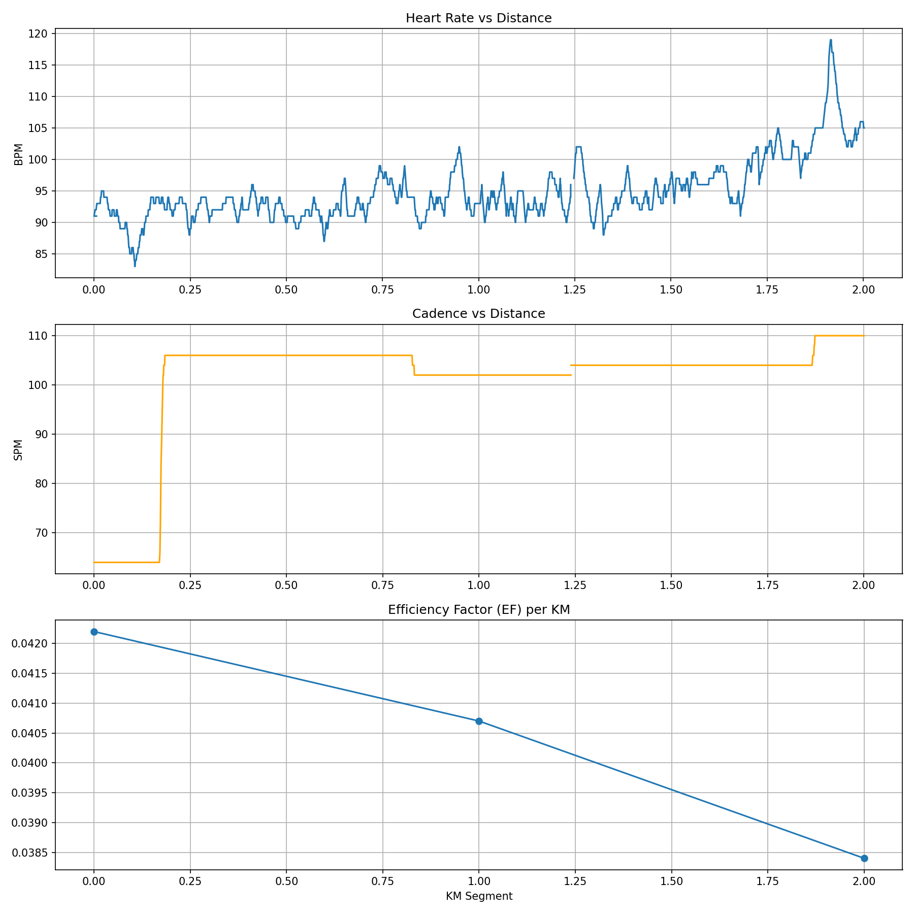

# 最新跑步分析报告

**文件**: 2025-12-30-115122-Outdoor

**总距离**: 2.00 km
**平均心率**: 94.7 bpm
**平均步频**: 100.9 spm

## 每公里数据

|   km_segment |   heart_rate |   speed_kmh |   cadence_real |   distance_km |     EF |   pace_min_per_km |
|-------------:|-------------:|------------:|---------------:|--------------:|-------:|------------------:|
|            0 |       92.475 |       3.898 |         97.673 |         1     | 0.0422 |             15.39 |
|            1 |       96.979 |       3.949 |        104.138 |         2     | 0.0407 |             15.19 |
|            2 |      105     |       4.036 |        110     |         2.002 | 0.0384 |             14.87 |

